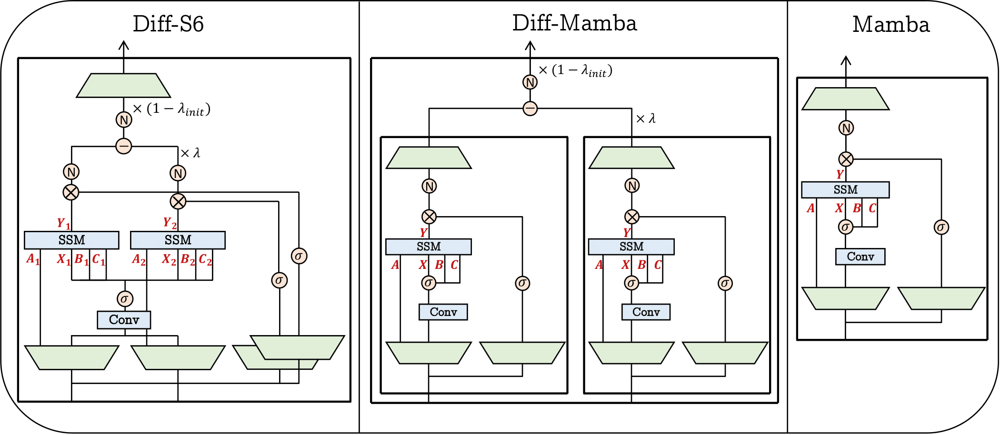
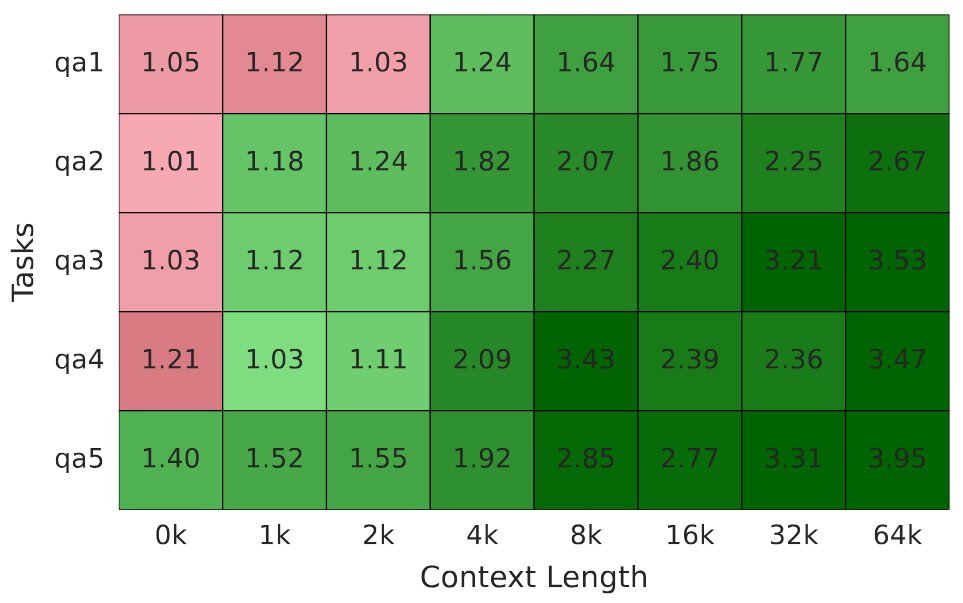
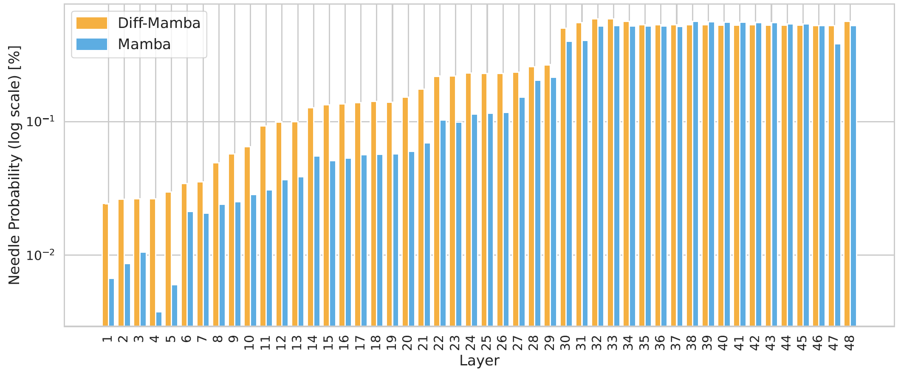

# Differential Mamba

<p align="center">

<a href="https://scholar.google.com/citations?user=CrBv6b4AAAAJ&hl=iw">Nadav Schneider</a>,
<a href="https://itamarzimm.github.io/">Itamar Zimerman</a>,
<a href="https://sites.google.com/view/eliya-nachmani/home">Eliya Nachmani</a>

<!-- <a href="https://arxiv.org/abs/2406.14528"></a> -->

This repository contains the official PyTorch implementation of Differential Mamba.
We also provide training code, evaluation code, and model checkpoints to reproduce the results in the paper, including all the baselines.

 

</p>
<br>

# Setup
## Clone Project
```
git clone https://github.com/nadavsc/Diff-Mamba.git
cd Diff-Mamba
```

## Create Environment
To set up our environment, please run:
```
conda env create -f environment.yml
conda activate diffmamba
```
Note: this should include all the necessary packages to run all the training and evaluation scripts. Nonetheless, make sure the additional requirements are satisfied:


Mamba Installation:
```
pip install causal-conv1d==1.5.0
pip install mamba-ssm==2.2.4
```

## Additional Requirements - Language Modeling

Install the requirements in: https://github.com/state-spaces/s4

In order to train/evaluate the Language Modeling task, first, download the data. This can be done using the following scripts:
```
python language_modeling/src/data/datasets/get_wt103.py
bash language_modeling/src/data/transformer-xl/enwik8/get_enwik8.sh
bash language_modeling/src/data/transformer-xl/text8/get_text8.sh
```
Then, move the resulting datasets into language_modeling/data directory.

## Additional Requirements - Retrieval

Install the requirements in: https://github.com/booydar/babilong

To fine-tune on PG19, please make sure to download the dataset according to the instructions at [deepmind/pg19](https://huggingface.co/datasets/deepmind/pg19) or use the Huggingface dataset version.

## Additional Requirements - Tuned-Lens

Install the requirements in: https://github.com/AlignmentResearch/tuned-lens

Make sure to download The-Pile validation set to train the lens.
Locate the .json or .txt file in the directory tuned-lens/data.

<be>

# Experiments
## Language Modeling
Run cd language_modeling.
Then, run the following:
```
python train.py experiment=lm/diffmamba2-text8 trainer.devices=[0] model.dropout=0.5 loader.l_max=512 train.seed=0 trainer.accumulate_grad_batches=1 loader.batch_size=50 model.n_layers=12 model.d_model=1024 trainer.max_epochs=40 trainer.precision=32
```

```trainer.devices```: used to determine the GPUs for training. [0] use cuda:0 while [2] use cuda:2. [0, 2] will use cuda:0 and cuda:2 with DDP training, while 2 will choose the first two gpus available (cuda:0 and cuda:1).

```loader.l_max```: the max length or context window for the current training

```model.n_layers```: determine the model size

```optimizer.lr```: to change the learning rate, otherwise, use the default

```trainer.max_epochs```: number of epochs

```loader.batch_size```: represent the batch size

```model.dropout```: the dropout of the current model

```trainer.seed```: responsible of the training seed

```accumulate_grad_batches```: can be used if the memory in the GPU is not sufficient for the required batch size


## Retrieval
 

Run cd retrieval.
To evaluate the models, make sure to save the models checkpoints in the Diff-Mamba/outputs directory.

### Finetune PG19
To finetune Mamba on PG19 run:
```
torchrun --nproc_per_node=4 finetune_pg19.py --model_id=AntonV/mamba2-370m-hf --lr=3e-4 --batch_size=6 --grad_accum_steps=12 --max_steps=4000 --weight_decay=0.1 --warmup=400 --save_steps=500 --eval_steps=500 --output_dir=./outputs/mamba2-370m-pg19-finetune
```
To finetune Diff-Mamba on PG19 run:
```
torchrun --nproc_per_node=4 finetune_pg19.py --model_id=AntonV/mamba2-370m-hf --diffmamba --lr=3e-4 --batch_size=6 --grad_accum_steps=12 --max_steps=4000 --weight_decay=0.1 --warmup=400 --save_steps=500 --eval_steps=500 --output_dir=./outputs
```

### Finetune BABILong
To finetune Mamba on BABILong run:
```
torchrun --nproc_per_node=1 finetune_needle.py --ckpt_path=./outputs/mamba2-370m-pg19-finetune --lr=3e-4 --batch_size=6 --grad_accum_steps=1 --max_steps=500 --weight_decay=0.1 --warmup=50 --save_steps=100 --eval_steps=100 --seed=0 --output_dir=./outputs/mamba2-370m-needle-finetune
```
To finetune Diff-Mamba on BABILong run:
```
torchrun --nproc_per_node=1 finetune_needle.py --ckpt_path=./outputs/diffmamba2-370m-pg19-finetune --diffmamba --lr=3e-4 --batch_size=6 --grad_accum_steps=1 --max_steps=500 --weight_decay=0.1 --warmup=50 --save_steps=100 --eval_steps=100 --seed=0 --output_dir=./outputs/diffmamba2-370m-needle-finetune
```

```--nproc_per_node```: choose number of GPUs for DDP training

```--grad_accum_steps```: this variable is used to increase effective batch size under memory limitations

```--diffmamba```: this is a flag that has to be chosen when training Diff-Mamba

```--model_id```: this is the mamba pretrained model loaded from Huggingface

### Evaluate

To evaluate a model on the different tasks and context lengths run:

```
bash scripts/run_activation-beacon-diffmamba2-370m-needle-finetune-seed0_no_instruct.sh
```
or
```
bash scripts/run_activation-beacon-diffmamba2-370m_pg19-finetune_no_instruct.sh
```
Results will be saved in the directory scripts/babilong_evals.

### Plot
To plot the scores, simply run:
```
python plot.py --model_name diffmamba2-370m-needle-finetune-seed0 --results_folder scripts/babilong_evals/diffmamba2-370m-needle-finetune-seed0
```
To plot the relative percentage run:
```
python plot_compare.py --model_name diffmamba2-370m-needle-finetune --ratio
```
The plot will be saved in scripts/babilong_evals. Use the flag ```--ratio``` for the relative precentage plot or omit it for the original scores plot

## Tuned-Lens
 

Run cd tuned-lens.
### Training Lens
Then to train lens for mamba, run:
```
python -m tuned_lens train --model.name ../../../outputs/mamba2-370m-pg19-finetune --data.name data/valid.txt --per_gpu_batch_size=1 --ssm --output my_lenses/mamba2-370m-pg19-finetune
```
To train diffmamba, specify the correct path to the model and change the required output directory.
To train the lens in a distributed fashion, change ```--per_gpu_batch_size``` to the number of available GPUs.

### Evaluate
To evaluate run:
```
python test_babilong_0k.py --ckpt_path ../../../outputs/mamba2-370m-needle-finetune 
```
add ```--diffmamba``` flag if using Diff-Mamba.

You can stop the test early when using the flag ```--num_examples```.  The compatible lens will be loaded from the my_lenses directory.

### Plot
To plot the results run:
```
python plot_tuned_lens.py --diff_results_path results/diffmamba2-370m-needle-finetune-lens_eval.txt --mamba_results_path results/mamba2-370m-needle-finetune-lens_eval.txt 
```
Use ```--log``` to create a log scale plot and ```--start-layer``` and ```--end-layer``` to choose specific layers to plot.

## Acknowledgements

All model implementations are based on [Mamba](https://github.com/state-spaces/mamba). Training and evaluation for the language modeling experiments are based on [S4](https://github.com/state-spaces/s4) repository. Evaluation on BABILong is based on [BABILong](https://github.com/booydar/babilong) repo, and measuring signal-to-noise ratio through the layers is based on [tuned-lens](https://github.com/AlignmentResearch/tuned-lens).

## Citation

If you use this code, please consider citing the following:

```
```
